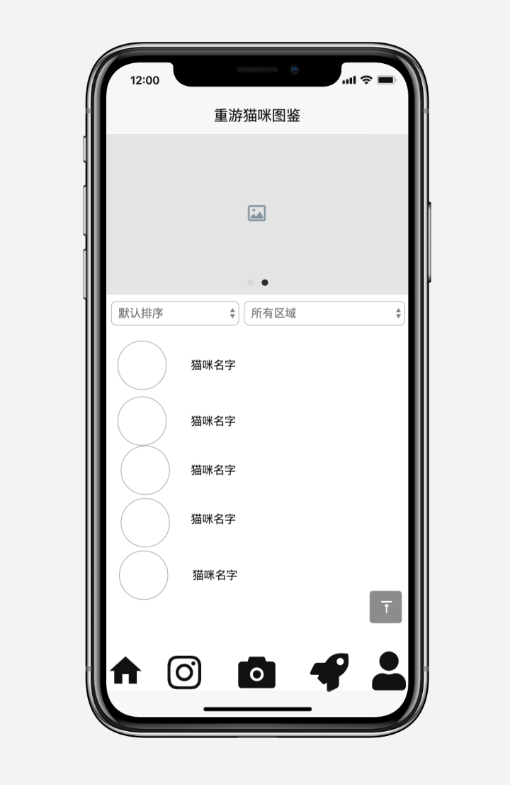
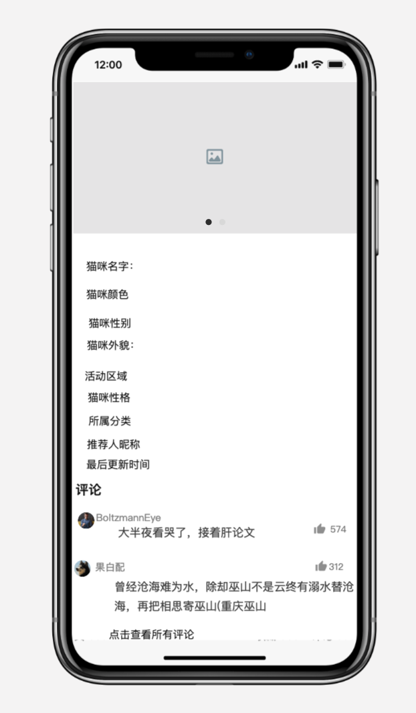
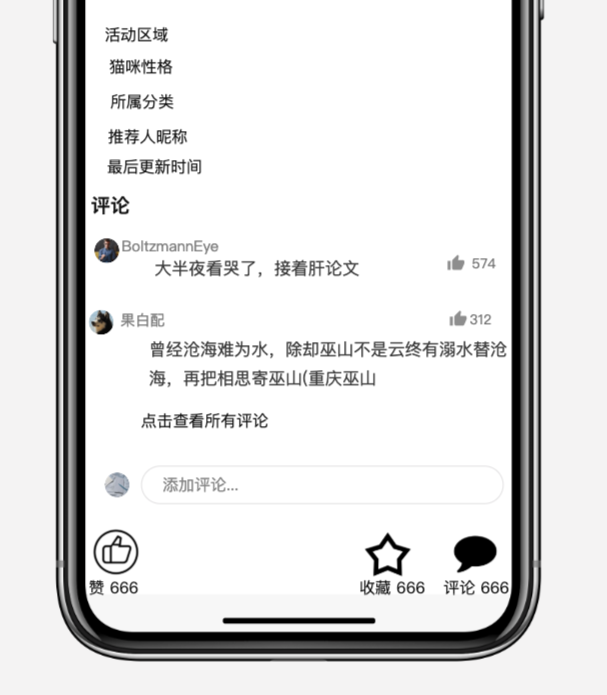
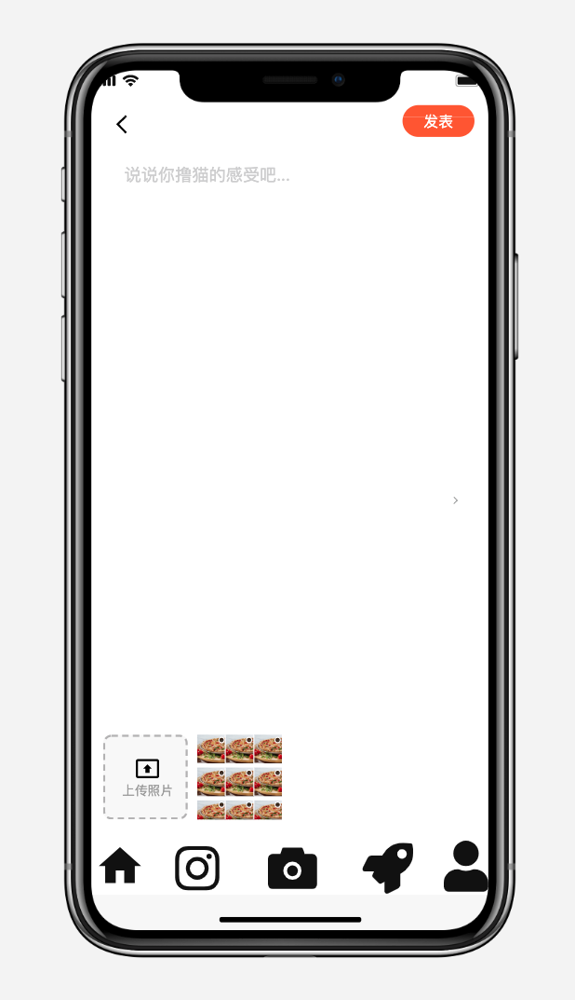
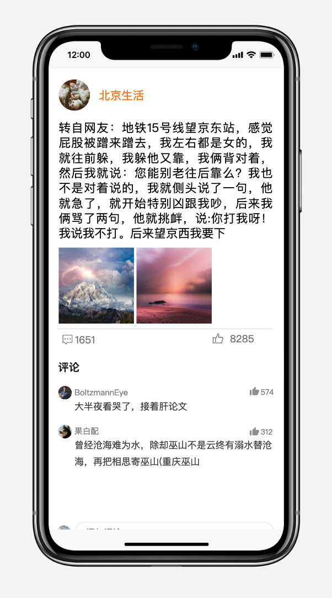
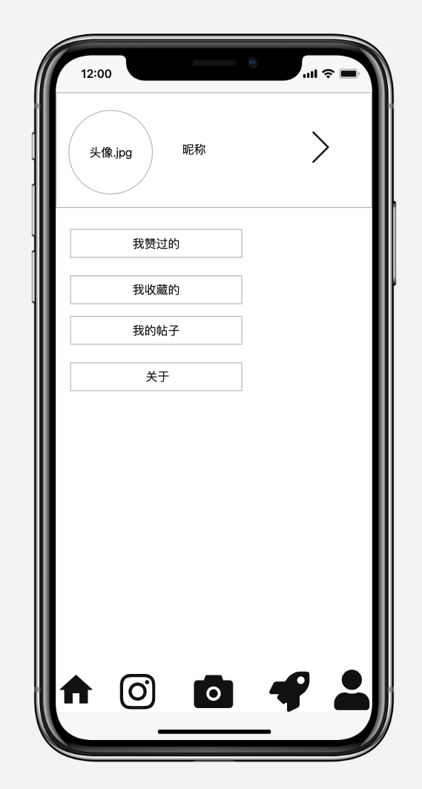
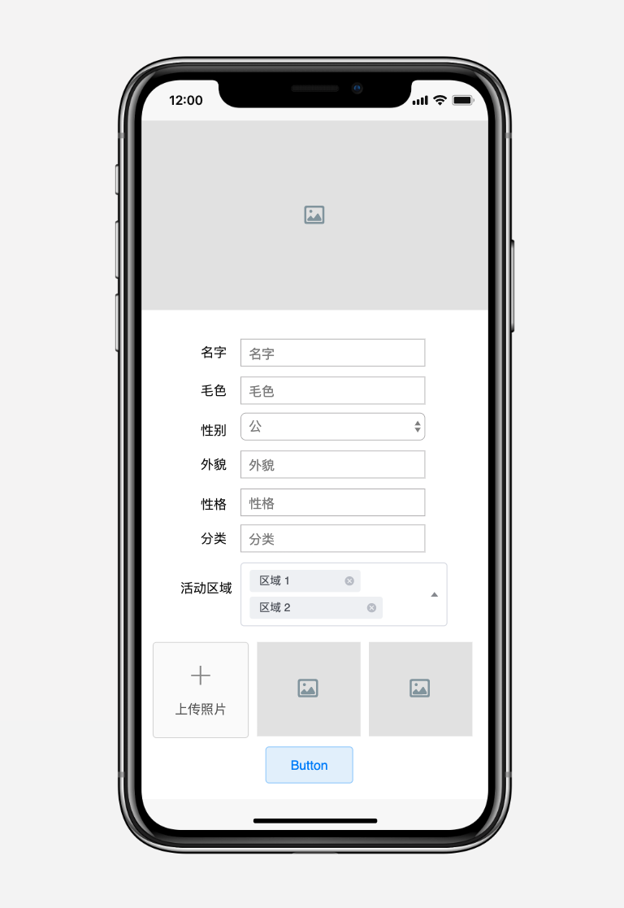

# 重游猫咪图鉴

## 为什么写?

写这个项目的目的本来是参加腾讯的小程序大赛,但是后来由于种种原因我们**弃权**了(主要还是懒),还有一个方面就是春节的时候,微博上出现了一个热搜就是关于一个研究生 lue 猫的事,然后一想到我们学校的🐈也很多,就突发奇想决定搞一个让大家可以看到我们学校🐱的信息的小程序,当然,有一部分是借鉴了北大猫咪图鉴.

## 关于我想到的功能

以下是我在最初本版本中能够想到的功能,原型的指导是学校的数码交流群群主**万能**给我的(此处手动@万能)

* 第一个功能当然就是老套路啦,在主页中能够看到一些猫咪的简介,这些猫咪都是通过用户的点赞和收藏通过加权算法推送的.

> 上面放出来的是原型图的首页图,也就是用户通过微信登录进入之后的看到的第一个界面,最下面的 5 个 btn 分别表示**首页** **动态**
>
> **发表动态** **推荐猫咪** **关于我** 这 5 个模块

在这个上面可以选择不同的排序方式看到不同的猫咪简介,也可以选择不同的区域筛选自己想要看到的简介,最上方有一个轮播图,就是最受欢迎的三只猫咪的首图

* 随便点击一个简介,即可进去猫咪的详情页,下面是这个详情页的原型图

> 原型图还是有点简陋,如果做出来肯定还是有样式优化的,然后下面的就是常规的**点赞收藏评论**,可以在这里看到别人的评论也可以添加自己的评论,或者是对别人的评论点赞,功能和常规的博文差不多,这里不做赘述.

* 还有就是发表动态的模块

> 还是一样,和常规的社交 APP 一样的

* 查看动态

> 上面是查看动态的原型图,上面的图文和主题无关

* 然后就是关于我

* 投稿

> 投稿也和一半的 APP 差不多的,后台管理员会审核投稿的 Cat 详情

## 还是没弄完

这个项目后端总共就是两个人在写,前端一个人,后端一个人,原型是我,UI 是我,如果写完了那运维应该也是我哈哈哈哈,但是后来由于要准备期末考试,实在是没办法就只好把这个项目搁置(然后就逾期了),本来是想在暑假把这个搞完的,但是我觉得我还是把时间拿去准备秋招比较好,这个就再拖一拖吧.害....

其实后端项目已经完成的差不多了,点最上面那个 view on github 就可以点到后端的项目去,要是你有缘能看到这里来,那就帮我康康代码规范不啦

